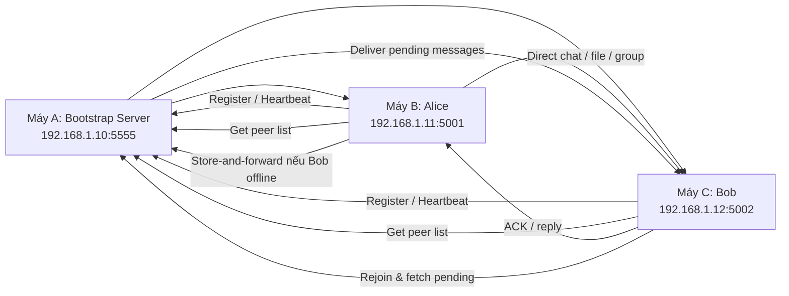

# P2P Chat System – E2EE, Group Chat, File Transfer

Ứng dụng chat ngang hàng (P2P) viết bằng Python 3, theo mô hình Bootstrap-assisted P2P, hỗ trợ mã hóa đầu cuối E2EE, nhắn tin 1-1, broadcast, nhóm chat, gửi file và store-and-forward cho peer offline.

## Mục lục
- Tổng quan
- Kiến trúc hệ thống
- Tính năng chính
- Giao thức nhắn tin
- Yêu cầu môi trường
- Hướng dẫn chạy chi tiết
- Kịch bản chạy trên cùng LAN
- Cấu trúc thư mục
- Kiểm thử và demo
- Ghi chú vận hành

## Tổng quan

Dự án gồm 3 thành phần chính:
- `bootstrap_server.py`: máy chủ bootstrap để đăng ký peer, lấy danh sách peer, heartbeat, leave và lưu tin nhắn chờ.
- `peer.py`: peer chạy dạng CLI, đóng vai trò vừa là server vừa là client.
- `peer_gui.py`: peer chạy giao diện đồ họa Tkinter/ttk.

Luồng hoạt động tổng quát:
1. Mỗi peer đăng ký vào bootstrap.
2. Bootstrap lưu danh sách peer đang online.
3. Peer trao đổi khóa Diffie-Hellman khi gửi tin nhắn lần đầu.
4. Nội dung chat/file được mã hóa E2EE trước khi gửi.
5. Nếu peer đích offline, bootstrap giữ lại tin nhắn để giao sau.

## Kiến trúc hệ thống

### Bootstrap server
- Lắng nghe TCP mặc định tại cổng `5555`.
- Duy trì registry peer đang online.
- Nhận `register`, `heartbeat`, `leave`.
- Lưu `store-and-forward` cho peer offline.
- Trả về batch tin nhắn chờ khi peer quay lại.

### Peer node
- Mỗi peer là một TCP server cục bộ để nhận tin nhắn từ peer khác.
- Đồng thời là TCP client khi gửi tin nhắn, gửi file hoặc lấy danh sách peer.
- Tự động thực hiện trao đổi khóa E2EE khi cần.

### Giao diện người dùng
- CLI: phù hợp để test nhanh, chạy nhiều terminal.
- GUI: thuận tiện thao tác, hiển thị tên peer, broadcast, chat 1-1, gửi file và nhóm chat.

## Tính năng chính

- E2EE bằng Diffie-Hellman + mã hóa đối xứng.
- Gửi chat 1-1 có ACK/retry.
- Broadcast toàn mạng.
- Group chat: tạo nhóm, thêm peer, gửi tin nhắn nhóm, rời nhóm.
- Gửi file mã hóa đầu cuối.
- Store-and-forward cho peer offline.
- Churn simulation ở CLI để mô phỏng join/leave liên tục.
- Hỗ trợ chạy trên nhiều máy trong cùng mạng LAN.

## Giao thức nhắn tin

Mọi message đều là JSON và kết thúc bằng ký tự xuống dòng `\n`.

### 1. Register
```json
{
  "type": "register",
  "ip": "192.168.1.10",
  "port": 5001,
  "name": "Alice"
}
```

### 2. Key exchange
```json
{
  "type": "key_exchange",
  "from": "Alice",
  "from_ip": "192.168.1.10",
  "from_port": 5001,
  "pub_key": "..."
}
```

### 3. Chat
```json
{
  "type": "chat",
  "from": "Alice",
  "from_ip": "192.168.1.10",
  "from_port": 5001,
  "ciphertext": "<base64>",
  "iv": "<base64>",
  "msg_id": "uuid"
}
```

### 4. File
```json
{
  "type": "file",
  "from": "Alice",
  "from_ip": "192.168.1.10",
  "from_port": 5001,
  "filename": "document.pdf",
  "ciphertext": "<base64>",
  "iv": "<base64>",
  "msg_id": "uuid"
}
```

### 5. Store-and-forward
```json
{
  "type": "store_forward",
  "target_ip": "192.168.1.11",
  "target_port": 5002,
  "message": { ... }
}
```

## Yêu cầu môi trường

- Python 3.8+; khuyến nghị Python 3.10 hoặc mới hơn.
- Không cần thư viện bên ngoài cho runtime chính.
- Nếu dùng GUI, máy phải hỗ trợ Tkinter.
- Khi chạy LAN, nên mở firewall cho:
  - Cổng bootstrap: `5555`
  - Cổng peer: ví dụ `5001`, `5002`, `5003`, ...

### Cài đặt kiểm thử

Runtime của dự án chỉ dùng thư viện chuẩn Python. Nếu muốn chạy test, cài thêm dependency dev:

```powershell
py -m pip install -r requirements-dev.txt
```

Nếu máy không có Tkinter, hãy cài bộ Python đầy đủ kèm Tcl/Tk.

### Mở firewall

**Windows (PowerShell chạy quyền admin):**

```powershell
netsh advfirewall firewall add rule name="P2P Bootstrap" dir=in action=allow protocol=TCP localport=5555
netsh advfirewall firewall add rule name="P2P Peer 5001" dir=in action=allow protocol=TCP localport=5001
```

**Linux (Ubuntu):**

```bash
sudo ufw allow 5555/tcp
sudo ufw allow 5001:5010/tcp
```

## Hướng dẫn chạy chi tiết

### Bước 1: Mở terminal tại thư mục dự án

```powershell
cd D:\p2p-chat-project
```

### Bước 2: Đồng bộ source mới nhất từ `main`

```powershell
git fetch origin
git checkout main
git reset --hard origin/main
```

### Bước 3: Chạy bootstrap server

Bootstrap là thành phần bắt buộc phải chạy trước tất cả peer.

```powershell
py bootstrap_server.py
```

Mặc định bootstrap lắng nghe tại:
- Host: `0.0.0.0`
- Port: `5555`

### Bước 4: Chạy peer CLI

Một peer CLI tối thiểu:

```powershell
py peer.py --name Alice --port 5001
```

Peer thứ hai:

```powershell
py peer.py --name Bob --port 5002
```

Nếu chạy trên máy khác nhau trong LAN, chỉ định rõ IP LAN của máy bootstrap:

```powershell
py peer.py --name Alice --ip 192.168.1.10 --port 5001 --bootstrap-host 192.168.1.10 --bootstrap-port 5555
py peer.py --name Bob --ip 192.168.1.11 --port 5002 --bootstrap-host 192.168.1.10 --bootstrap-port 5555
```

### Bước 5: Chạy peer GUI

```powershell
py peer_gui.py
```

Trong form đăng nhập của GUI:
- Tên hiển thị: đặt tùy ý, ví dụ `Alice`
- Cổng lắng nghe: ví dụ `5001`
- IP Bootstrap: nhập IP LAN của máy chạy `bootstrap_server.py`
- Cổng Bootstrap: `5555`

Lưu ý:
- GUI sẽ tự hiển thị IP LAN của chính máy trên sidebar.
- Khi dùng LAN thật, mỗi máy phải dùng một cổng peer khác nhau.

### Bước 6: Gửi tin nhắn và file trong CLI

Các lệnh chính trong CLI:

```powershell
!peers
!send <index/ip:port> <tin nhắn>
!broadcast <tin nhắn>
!sendfile <index/ip:port> <duong_dan_file>
!gcreate <ten_nhom>
!gadd <ten_nhom> <index>
!gsend <ten_nhom> <tin nhắn>
!gleave <ten_nhom>
!glist
!leave
!help
```

Ví dụ:

```powershell
!peers
!send 1 Xin chao Bob
!broadcast Xin chao toan mang
!sendfile 1 D:\p2p-chat-project\test.txt
```

### Bước 7: Churn simulation trên CLI

Chạy peer ở chế độ mô phỏng rời mạng và quay lại:

```powershell
py peer.py --name Alice --port 5001 --churn --churn-online-seconds 20 --churn-offline-seconds 10
```

Tùy chọn:
- `--churn-cycles N`: số lần rời/quay lại mạng.
- `--churn-online-seconds`: thời gian online trước khi rời mạng.
- `--churn-offline-seconds`: thời gian offline trước khi quay lại.

## Kịch bản chạy trên cùng LAN

Giả sử có 3 máy trong cùng mạng nội bộ:

- Máy A chạy bootstrap server: `192.168.1.10`
- Máy B chạy Alice: `192.168.1.11`
- Máy C chạy Bob: `192.168.1.12`

### Trên máy A

```powershell
cd D:\p2p-chat-project
py bootstrap_server.py
```

### Trên máy B

```powershell
cd D:\p2p-chat-project
py peer_gui.py
```

Điền:
- Tên hiển thị: `Alice`
- Cổng lắng nghe: `5001`
- IP Bootstrap: `192.168.1.10`
- Cổng Bootstrap: `5555`

### Trên máy C

```powershell
cd D:\p2p-chat-project
py peer_gui.py
```

Điền:
- Tên hiển thị: `Bob`
- Cổng lắng nghe: `5002`
- IP Bootstrap: `192.168.1.10`
- Cổng Bootstrap: `5555`

### Điều cần nhớ khi chạy LAN

- Không dùng cùng một cổng peer trên nhiều máy.
- Peer phải dùng IP LAN thật của máy đó, không phải `127.0.0.1`.
- Máy chạy bootstrap phải cho phép inbound TCP port `5555`.
- Máy chạy peer phải cho phép inbound TCP port của peer đó.

### Sơ đồ luồng chạy LAN



Luồng trên minh họa cách bootstrap làm trung tâm điều phối, còn các peer vẫn giao tiếp trực tiếp với nhau sau khi đã biết địa chỉ LAN của nhau.

## Cấu trúc thư mục

```text
bootstrap_server.py   # Bootstrap registry + store-and-forward
peer.py               # Peer CLI
peer_gui.py           # Peer GUI
common/
  encryption.py       # Diffie-Hellman + mã hóa/giải mã
  message.py          # Định nghĩa message type
  utils.py            # JSON socket helpers + tiện ích IP
demo_churn.py         # Demo churn + store-and-forward
requirements-dev.txt   # Dependency cho test
tests/                # Pytest suite
received/             # Nơi lưu file nhận được
```

## Kiểm thử và demo

### Cài dependency test

```powershell
py -m pip install -r requirements-dev.txt
```

### Chạy toàn bộ test

```powershell
py -m pytest -q
```

### Chạy test riêng phần peer

```powershell
py -m pytest -q tests/test_p2p_features.py
```

### Chạy demo churn + store-and-forward

```powershell
py demo_churn.py
```

Demo này sẽ tự dựng bootstrap, Alice, Bob, Carol, rồi kiểm tra:
- đăng ký peer
- chat có ACK
- gửi file mã hóa
- store-and-forward khi peer offline
- peer quay lại và nhận tin nhắn chờ

## Ghi chú vận hành

- File nhận được sẽ nằm trong thư mục `received/`.
- Nếu GUI không mở được trên máy hiện tại, hãy dùng CLI để kiểm tra luồng mạng.
- Nếu chạy LAN mà peer không thấy nhau, kiểm tra firewall và IP bootstrap đã nhập đúng chưa.
- Nếu chỉ có một peer online, danh sách peer khác có thể rỗng vì hệ thống không hiện chính peer đang đăng ký.

## Giới hạn của hệ thống

- Hiện tại chỉ hoạt động tốt trong môi trường **mạng LAN**.
- Chưa hỗ trợ **NAT traversal**; muốn đi qua Internet cần cấu hình port forwarding thủ công.
- **Bootstrap server** là điểm tập trung duy nhất, nên nếu nó dừng thì peer mới không thể vào mạng.
- Gửi file rất lớn có thể làm tăng độ trễ do cơ chế ACK/retry.
- Chưa lưu lịch sử tin nhắn cục bộ sau khi thoát ứng dụng.

## Demo trực quan


## Đóng góp

- Tạo branch mới từ `main`.
- Commit nên ngắn gọn, đúng phạm vi, ví dụ `feat:`, `fix:`, `docs:`.
- Giữ thay đổi tập trung, tránh sửa lan man.

## License

Xem metadata của repository để biết thông tin license.

