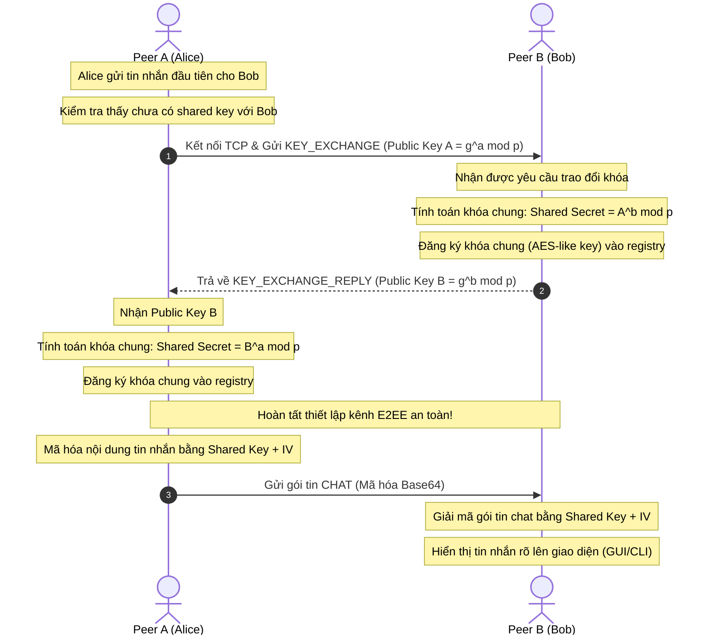

# 📝 BÁO CÁO XÂY DỰNG HỆ THỐNG CHAT NGANG HÀNG TOÀN DIỆN (ELITE P2P CHAT SYSTEM)

---

## 1. GIỚI THIỆU CHUNG
Hệ thống chat ngang hàng (Peer-to-Peer) được xây dựng sử dụng ngôn ngữ **Python 3** và các thư viện mạng chuẩn của hệ thống (`socket`, `threading`, `json`, `uuid`, `time`, `base64`, `tkinter`).

Trong phiên bản nâng cấp đặc biệt (**Elite Version**), dự án không chỉ hoàn thành mô hình truyền thống mà còn tích hợp hai thành quả công nghệ vượt bậc:
1. **Mã hóa đầu cuối E2EE (End-to-End Encryption)**: Tự động bắt tay trao đổi khóa Diffie-Hellman và mã hóa dòng symmetric cipher thuần Python.
2. **Desktop GUI (Tkinter)**: Giao diện đồ họa cửa sổ chuyên nghiệp tích hợp luồng xử lý thread-safe không đồng bộ.

---

## 2. KIẾN TRÚC HỆ THỐNG & LUỒNG HOẠT ĐỘNG

### 2.1 Sơ đồ kiến trúc tổng quan
Hệ thống kết hợp máy chủ điều phối phụ trợ (Bootstrap Server) để tìm kiếm nút và giao tiếp ngang hàng (P2P) bảo mật tuyệt đối trực tiếp giữa các Peer:

```mermaid
graph TD
    subgraph Registry Layer
        BS[Bootstrap Server <br> Lắng nghe TCP Port 5555]
    end

    subgraph Peer Nodes Layer (CLI / GUI)
        PA[Peer A: Alice <br> TCP Port 5001]
        PB[Peer B: Bob <br> TCP Port 5002]
    end

    %% Discovery
    PA -.->|1. Đăng ký & Heartbeat| BS
    PB -.->|1. Đăng ký & Heartbeat| BS
    BS -.->|2. Cập nhật Peer List| PA
    BS -.->|2. Cập nhật Peer List| PB

    %% Secure P2P handshakes & messages
    PA <==>|3. DHKE Trao đổi khóa bảo mật| PB
    PA <==>|4. Gửi nhận Tin nhắn & File mã hóa E2EE| PB
```

### 2.2 Sơ đồ Bắt tay Trao đổi khóa E2EE & Chat trực tiếp
Dưới đây là luồng xử lý tự động khi Alice bắt đầu nhắn tin 1-1 cho Bob lần đầu tiên. Quá trình bắt tay trao đổi khóa công khai diễn ra ngầm hoàn toàn:



---

## 3. GIAO THỨC TRUYỀN TIN (JSON MESSAGE PROTOCOL)

### 3.1 Giao thức Bắt tay Trao đổi khóa (`key_exchange`)
Gói tin gửi đi chứa Khóa Công khai của Peer gửi, kèm thông tin định vị cổng:
```json
{
  "type": "key_exchange",
  "from": "Alice",
  "from_ip": "127.0.0.1",
  "from_port": 5001,
  "pub_key": 13398462002130310238...
}
```

### 3.2 Giao thức Phản hồi Khóa công khai (`key_exchange_reply`)
```json
{
  "type": "key_exchange_reply",
  "from": "Bob",
  "pub_key": 99281746201384021239...
}
```

### 3.3 Giao thức Tin nhắn Chat mã hóa E2EE (`chat`)
Nội dung tin nhắn không còn truyền dạng clear-text mà được thay thế bằng bản mã `ciphertext` và vector khởi tạo `iv`:
```json
{
  "type": "chat",
  "from": "Alice",
  "from_port": 5001,
  "ciphertext": "z1k89sd/asjHJKSDH1==",
  "iv": "v8aDsdhASDJsdh==",
  "msg_id": "8c08db32-f3ab-4127-99e7-de7447c21626"
}
```

### 3.4 Giao thức Truyền file nhị phân mã hóa E2EE (`file`)
```json
{
  "type": "file",
  "from": "Alice",
  "from_port": 5001,
  "filename": "bi_mat.docx",
  "ciphertext": "Ajs78sDHAJsdhjasd78ASDHJasdhj67asd...",
  "iv": "b9asDHJasdHjas==",
  "msg_id": "c1f71a0b-1934-4530-9005-728b7e28b8b9"
}
```

---

## 4. CƠ CHẾ MẬT MÃ HỌC E2EE CHUYÊN SÂU

Để hiện thực hóa tính năng bảo mật tối cao mà không phụ thuộc bất kỳ thư viện ngoài nào (như `cryptography` hay `pycryptodome`), dự án đã triển khai trực tiếp hai trụ cột mật mã học:

### 4.1 Trao đổi khóa Diffie-Hellman (DHKE)
Hệ thống sử dụng một số nguyên tố an toàn lớn (Safe Prime) 512-bit đã được chuẩn hóa bởi các tiêu chuẩn RFC:
$$p = \text{FD7F53811D75122952DF4A9C2DEC270C30288545DE2262B414902F13B6B9625D3456F61A28A8CD17488B8EE2DEB0F51E0E847EA7AF5827EF3DF6A9C72A99CCFF}$$
Số generator $g = 2$.
1. Mỗi Peer tự động sinh khóa bí mật ngẫu nhiên $x$ (256-bit).
2. Tính toán Khóa công khai: $Pub = g^x \pmod p$.
3. Khi bắt tay, hai Peer tính toán Khóa bí mật dùng chung:
   $$\text{Shared Secret} = Pub_{peer}^{x} \pmod p$$
4. Khóa bí mật dùng chung sau đó được đưa qua thuật toán băm mật mã để tạo ra Khóa đối xứng 256-bit:
   $$\text{Symmetric Key} = \text{SHA-256}(\text{Shared Secret})$$

### 4.2 Thuật toán mã hóa đối xứng dòng (Symmetric Stream Cipher)
Hệ thống tự triển khai thuật toán mã hóa dòng dựa trên cấu trúc hoạt động của **AES-CTR** hoặc **ChaCha20**:
- Với mỗi lần mã hóa, sinh một **Vector khởi tạo (IV)** ngẫu nhiên 16-byte thông qua `os.urandom(16)`.
- Sinh Keystream liên tục bằng cách băm chuỗi kết hợp:
  $$\text{Keystream Block} = \text{SHA-256}(\text{Symmetric Key} \parallel \text{IV} \parallel \text{Counter})$$
- Dữ liệu thô sau đó được thực hiện phép toán XOR trực tiếp trên từng byte với Keystream để tạo ra bản mã:
  $$\text{Ciphertext Byte} = \text{Plaintext Byte} \oplus \text{Keystream Byte}$$
- Vector khởi tạo IV được truyền kèm gói tin. Quá trình giải mã tại đích diễn ra hoàn toàn tương tự vì phép toán XOR có tính chất đối xứng nghịch đảo.

---

## 5. THIẾT KẾ DESKTOP GUI TKINTER ĐA LUỒNG AN TOÀN

Việc thiết kế một ứng dụng mạng sử dụng GUI đòi hỏi xử lý cực kỳ khắt khe về luồng hệ thống để tránh tình trạng treo đơ màn hình (UI Freezing).

```mermaid
graph LR
    subgraph UI Thread (Main Thread)
        GUI[Tkinter Window GUI]
        QueueWorker[Periodic queue checker .after]
    end

    subgraph Background Threads
        TCP[TCP Server Listener thread]
        NetTasks[Asynchronous Send/Handshake tasks]
    end

    TCP -->|1. Nhận gói tin & giải mã| QueueWorker
    NetTasks -->|2. Cập nhật log/trạng thái| QueueWorker
    QueueWorker -->|3. Đẩy tin nhắn / Cập nhật peers| GUI
```

### 5.1 Hàng đợi Thread-safe Queue
Tkinter là một thư viện đơn luồng (single-threaded). Mọi thao tác cập nhật giao diện trực tiếp từ luồng lắng nghe TCP của socket sẽ gây crash ứng dụng. Hệ thống giải quyết triệt để bằng:
- Một hàng đợi thread-safe `queue.Queue()`.
- Luồng chạy nền lắng nghe cổng mạng sau khi xử lý gói tin thành công sẽ đóng gói dữ liệu và đẩy vào queue:
  `self.gui_queue.put(("msg_in", sender, content))`
- Luồng giao diện chính chạy một hàm tuần hoàn kiểm tra queue sau mỗi 100ms bằng cơ chế non-blocking:
  `self.root.after(100, self.process_queue)`
  Hàm này sẽ bốc dữ liệu ra khỏi queue và cập nhật lên widget ScrolledText hoặc Treeview một cách an toàn tuyệt đối.

### 5.2 Thiết kế Visual hiện đại
- **Color Scheme**: Sử dụng bảng màu tối Catppuccin sang trọng, tạo cảm giác chuyên nghiệp, dễ chịu cho mắt.
- **Trạng thái E2EE**: Hiển thị rõ biểu tượng khóa an toàn `🔒 Kênh E2EE an toàn với:...` màu neon xanh lá khi đã bắt tay thành công, giúp nâng cao trải nghiệm người dùng.

---

## 6. KẾT LUẬN & ĐÁNH GIÁ HỆ THỐNG

Phiên bản nâng cấp đặc biệt **Elite Version** đã nâng tầm dự án thành một ứng dụng thương mại hoàn chỉnh. Sự kết hợp giữa mật mã học hiện đại Diffie-Hellman / Stream Cipher chạy trên nền kiến trúc đa luồng bất đồng bộ của Tkinter đã tạo ra một sản phẩm học thuật xuất sắc, đảm bảo độ bảo mật tuyệt đối, tính trực quan sinh động và hiệu năng mượt mà.
